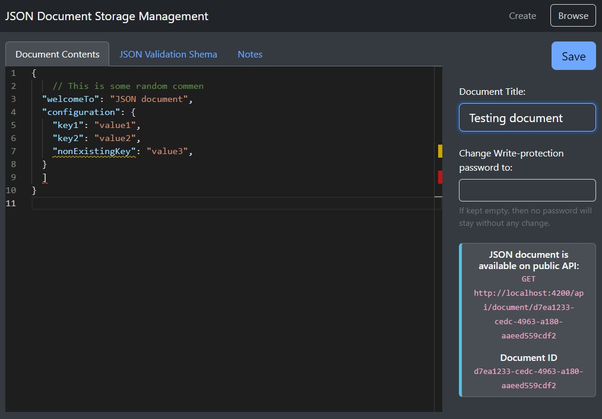

JSON Document Storage
=====================

JSON Document Storage is the JSON documents database with:

- REST API for getting documents anywhere,
- Web UI for document management (add/edit),
- JSON schema validator for avoiding data structure corruption,
- Internal text notes for keeping any useful information or manuals,
- JSON comments and custom formatting for keeping documents easy to manage.
- Optional document change protection by password.
- Advanced web editor with JSON highlighting, validation and suggestions based on defined schema.

Screenshot
----------



Purpose
-------

Application can be useful for new application development/prototyping, when some configuration or data editation is required
immediately. Requirement to edit/manage something in the app mostly comes from other people in your team. And sometimes it is
too costly to develop a custom admin page in your app. In this case as fast alternative to admin page in your app it can be
this JSON Document Storage.

Docker
------

Application is ready to run in Docker. Just before the first run you need to create `docker-compose.override.yml`
based on a template stored in the `docker-compose.override.template.yml` file. There you will fill random new database password
two times and then you can build and run the container by:

```bash
docker compose build
docker compose up -d
docker compose logs
```

Authorization to management UI / Document change protection
------------------------------------------------------------

All JSON documents are free to read over the API. If some update/edit is needed, each JSON document can be protected
by `write password`. It's an optional secret entered during document creation, and it is required later for any document change.
If no write password is entered, then the document can be updated by anybody who knows the application URL
(usable on a private network).

`Write password` of each document can be updated anytime by entering the new password into documentation edit form
before document save.

### Technicalities

App is designed to be absolutely standalone. No special external authorization mechanism (like AD) is needed.

HTTPS is highly recommended in case a `write password` is used. It is because the password is being sent during
all document updates unprotected via HTTP header `Authorization: Bearer base64(write_password)`.

HTTPS webserver is not implemented in the app. You need to implement HTTPS gateway by reverse proxy (like Apache, Nginx).

If 3rd party reverse proxy is being used, you can protect anyhow a document changing by protecting of following URLs:

 - /api/manage/*
 - /manage/*
 